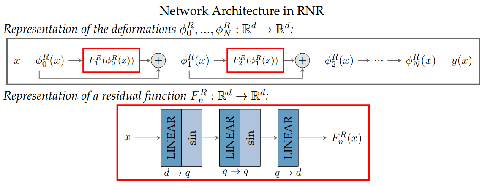

# Residual Neural Network-based Registration (RNR)

This is the code for the image registration method RNR, which is introduced and comprehensively evaluated in [Analysis of 3D/2D Image Registration and a New Registration Approach Based on Residual Neural Networks](link follows).
RNR enables the registration of multiple consecutive images. In order to provide deformations that build on each other in a meaningful way, data from intermediate time points can be input into RNR. Moreover, the method allows for diffeomorphic deformations.
In this code we apply RNR on thoracic CT images, more precisely we use the DIR-Lab 4D CT dataset.

# Idea of RNR

RNR uses an implicit neural representation (INR) to represent deformations. The method is based on large deformation diffeomorphic metric mapping (LDDMM), a popular approach for diffeomorphic registration. In contrast, to classical LDDMM methods, RNR uses residual neural networks (ResNets) for the representation of the deformations, which results in reduced computational effort. In addition, the network structure within RNR enables large deformations. 

The following figure visualizes the network structure in RNR. As the DIR-Lab dataset contains 3D images, we have the dimension *d=3* in our experiments. The network width is set by default to *q=100*.

In order to calculate the deformations, we train the network such that it minimizes the energy 

As data fitting term the normalized cross-correlation (NCC) is utilized. For regularization the weight matrices in the network are penalized, which ensures that a minimizer of the energy exists. Additionally, as penalty the gradients of the residual functions are added to the loss, which controls the smoothness of the deformations and leads to diffeomorphic solutions.

# Running the code

You will need [PyTorch](https://pytorch.org/) to run the code. For the registration of inspiration and expiration images including the corresponding intermediate data for a patient in the DIR-Lab dataset, just run `run.py`. 

By default the intermediate data between inspiration and expiration is used, but registration with RNR can also be performed without this data. The code can be executed either on a CPU or on a CUDA-enabled GPU. Various parameters of the model can be changed using the dictionary `args` in `run.py`. The default parameters can be found in `models/model.py`. 

As output, you will get the mean and standard deviation of the target registration (TRE) error for the 300 anatomical landmarks in Euclidean distance as well as per axis. In addition, it is checked whether the calculated deformations cause undesirable image folding. Moreover, multiple visualizations provide a visual impression of the registration result. Before registration the moving image (inspiration) and fixed images (expiration and intermediate data) as well as the corresponding difference images are shown. After registration the deformed moving images as well as the difference images to the corresponding fixed images are visualized for each time step.

# Data Preparation

In this code we use the DIR-Lab 4D CT dataset. Download the data from the [DIR-LAB website](https://med.emory.edu/departments/radiation-oncology/research-laboratories/deformable-image-registration/downloads-and-reference-data/4dct.html) [1] and save the downloaded cases in the folder *data*. For each case the subfolders *ExtremePhases* and *Images* are required. Moreover, we use lung masks as it is common practice. Therefore, for each case create a lung segmentation (`.mhd`) and save the segmentation in the subfolder *Masks*.
The masks can be obtained using the deep learning-based lung segmentation algorithm of Hoffmanninger et al. [2], see [GitHub page](https://github.com/JoHof/lungmask). You can of course also use different lung masks or different file formats. Note, that you need to set `dir` in `run.py` according to your personal path. The file structure should look as follows:

📦data  
 ┣ 📂Case1Pack  
 ┃ ┣ 📂ExtremePhases  
 ┃ ┃ ┣ 📜Case1_300_T00_xyz.txt  
 ┃ ┃ ┗ 📜Case1_300_T50_xyz.txt  
 ┃ ┣ 📂Images  
 ┃ ┃ ┣ 📜case1_T00_s.img  
 ┃ ┃ ┣ 📜case1_T10_s.img  
 ┃ ┃ ┣ 📜case1_T20_s.img  
 ┃ ┃ ┣ 📜case1_T30_s.img  
 ┃ ┃ ┣ 📜case1_T40_s.img  
 ┃ ┃ ┗ 📜case1_T50_s.img  
 ┃ ┗ 📂Masks  
 ┃ ┃ ┣ 📜case1_T00_mask.mhd  
 ┣ 📂Case2Pack  
 ┃ ┣..  
 ┃..  
 ┣ 📂Case10Pack  
 ┃ ┣ 📂extremePhases  
 ┃ ┃ ┣ 📜case10_dirLab300_T00_xyz.txt  
 ┃ ┃ ┗ 📜case10_dirLab300_T50_xyz.txt  
 ┃ ┣ 📂Images  
 ┃ ┃ ┣ 📜case10_T00.img  
 ┃ ┃ ┣ 📜case10_T10.img  
 ┃ ┃ ┣ 📜case10_T20.img  
 ┃ ┃ ┣ 📜case10_T30.img  
 ┃ ┃ ┣ 📜case10_T40.img  
 ┃ ┃ ┣ 📜case10_T50.img  
 ┃ ┗ 📂Masks  
 ┃ ┃ ┣ 📜case10_T00_mask.mhd  

# Reference

If you use this code, please cite the following work, which contains a detailed introduction as well as a comprehensive evaluation of RNR.

    @phdthesis{2026PhDSchulz,
      title  = {Analysis of 3D/2D Image Registration and a New Registration Approach Based on Residual Neural Networks},
      author = {Schulz, Pia Franziska},
      year   = {2026},
      school = {Institute of Mathematics and Image Computing, University of Lübeck} 
    }

# Related Literature

RNR is based on the point cloud registration approach  of Ben Amor et al. [3], which also utilizes ResNets. RNR differs from the method in [3] mainly by three aspects:

1. RNR performs intensity-based instead of point cloud registration. 
2. RNR incorporates information about the motion by integrating intermediate data.
3. RNR utilizes a different network architecture for the residual functions.

For details, see [Analysis of 3D/2D Image Registration and a New Registration Approach Based on Residual Neural Networks](link follows).

The implementation of RNR provided here is built on the code basis of Wolterink et al. [4], that contains a method for intensity-based image registration based on INRs, see also the [GitHub page](https://github.com/MIAGroupUT/IDIR).

 

[1] R. Castillo, E. Castillo, R. Guerra, V. E. Johnson, T. McPhail, A. K. Garg, and T. Guerrero, “A framework for evaluation of deformable image registration spatial accuracy using large landmark point sets,” Phys. Med. Biol., vol. 54, no. 7, pp. 1849–1870, 2009.

[2] J. Hofmanninger, F. Prayer, J. Pan et al., "Automatic lung segmentation in routine imaging is primarily a data diversity problem, not a methodology problem", Eur. Radiol. Exp., vol. 4, 50, 2020.

[3] B. Ben Amor, S. Arguillère, and L. Shao, “Resnet-lddmm: advancing the lddmm framework using deep residual networks,” IEEE Trans. Pattern Anal. Mach. Intell., vol. 45, no. 3, pp. 3707–3720, 2023.

[4] J. M. Wolterink, J. C. Zwienenberg, and C. Brune, “Implicit neural representations for deformable image registration,” in Proc. MIDL 2022, pp. 1349–1359, PMLR, 2022.

